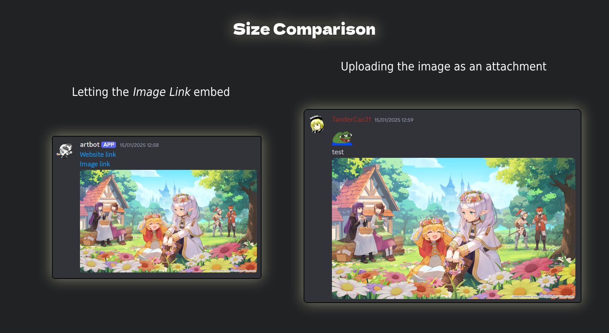

# DiscordArtBot

A bot that regularly sends **high-scoring images** from the art hosting website [Safebooru](https://safebooru.donmai.us) into select Discord channels of a single Discord server.  

It's made up of two main scripts: an **hourly** script and a **daily** script.  
These are meant to be executed every 1 hour and every 24 hours respectively, through an automated task scheduler such as Windows Task Scheduler.  

## "High-scoring" Images?
- In its daily script, the bot generates a score threshold for each given character. This number is based on the average score accumulated by the character's posts in the last month.  
- In the hourly script, this monthly average is used to search posts with matching or better score on Safebooru.

This gives us a metric to judge the performance and perceived **quality** of each image on the site: filtering out low-quality images without flooding each channel.

### High Quality, in more ways than one
The messages sent by the bot **choose dynamically** whether to use an attachment to upload the image or to let the website's link embed instead. This is done to deal with Discord's 10MB upload limit.

The silver lining is: an image sent with a **directly uploaded** attachment shows up **larger** on the Discord app.  
It's for this reason that the bot attempts to use an attachment when it can.

## Uploading Images Yourself?
If the image is smaller than 10MB in size, the bot will attempt to upload it using your internet connection.  
This may cause problems if your connection happens to be poor at the moment of execution, but worry not: if any errors arise, the bot accounts for it and adds an extra couple minutes of wait time before the end of its execution.  
- Discord API timeouts result in **messages being sent multiple times**.

If it takes too long to upload an image, the message might be sent three or four times.  
The extra minutes of wait time ensure all **accidental duplicate uploads** are caught and deleted.  

## One character, One channel
The bot creates a channel for each character added to the database.  
The posts will then be neatly divided and posted in the respective character's channel.  
To add a new character for the bot to track, manually add a new row to the characters table, specifying the character's tag and the name its Discord channel will use.
